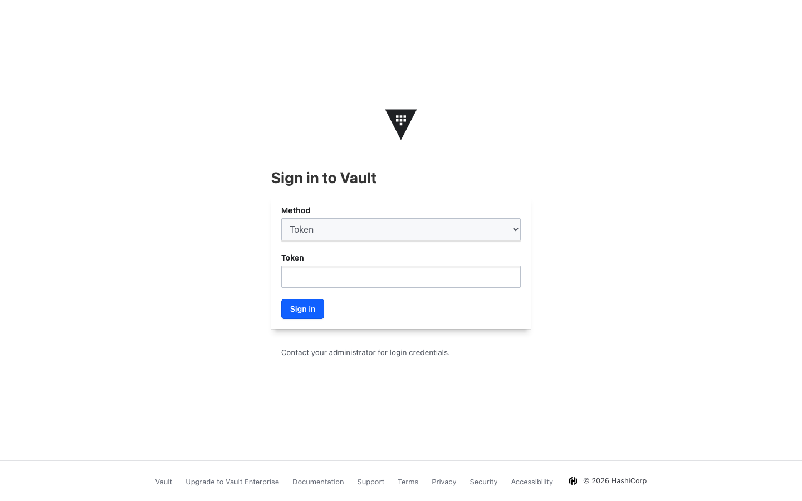
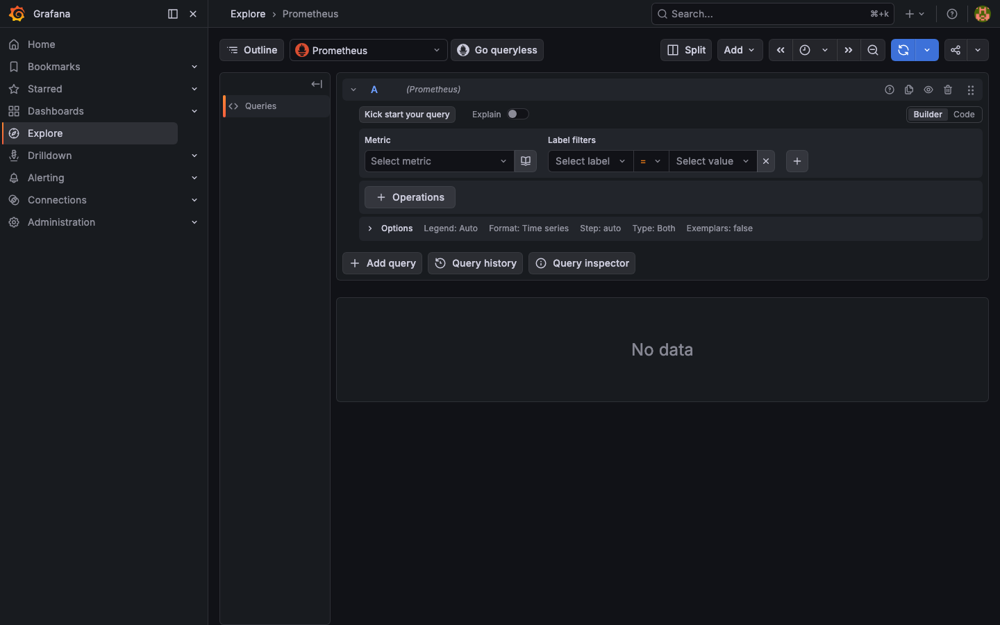

# DevOps MCP Toolkit

> **15 MCP servers** to manage a complete local DevOps stack running on Kubernetes (Docker Desktop) — no cloud account required.

[](https://github.com/narayanareddy99910/mcp-server-01/releases)
[](LICENSE)
[](https://python.org)
[](https://kubernetes.io)
[](https://modelcontextprotocol.io)
[](https://streamlit.io)
[](https://hub.docker.com/u/narayanareddy99910)
[](#-mcp-tools--versions)
[](#-mcp-tools--versions)
[](#-services--versions)

---

## 🛠️ MCP Tools & Versions

> **Runtime:** Python `3.13.5` &nbsp;·&nbsp; MCP SDK `1.27.0` &nbsp;·&nbsp; Transport: `stdio`

| # | MCP Name | Server File | Tools | Controls |
|---|----------|-------------|------:|----------|
| 1 | `docker-manager` | `servers/01_docker_manager.py` | **20** | Containers, images, volumes, networks, exec, stats, prune |
| 2 | `terraform-manager` | `servers/02_terraform_manager.py` | **14** | Init, plan, apply, destroy, state, workspace, outputs |
| 3 | `sonarqube-manager` | `servers/03_sonarqube_manager.py` | **14** | Projects, issues, quality gates, metrics, tokens, scanner |
| 4 | `jenkins-manager` | `servers/04_jenkins_manager.py` | **16** | Jobs, builds, trigger, create, delete, nodes, plugins, queue |
| 5 | `devops-dashboard` | `servers/05_devops_dashboard.py` | **8** | Full-stack health, Docker summary, Jenkins/Sonar/Terraform status |
| 6 | `kubernetes-manager` | `servers/06_kubernetes_manager.py` | **24** | Pods, deployments, services, namespaces, events, logs, apply YAML |
| 7 | `prometheus-grafana` | `servers/07_prometheus_grafana.py` | **15** | PromQL, range queries, targets, alerts, dashboards, datasources |
| 8 | `argocd-manager` | `servers/08_argocd_manager.py` | **12** | Apps, sync, rollback, create, delete, repos, clusters |
| 9 | `trivy-scanner` | `servers/09_trivy_scanner.py` | **10** | Image scan, IaC scan, K8s cluster scan, SBOM, DB update |
| 10 | `helm-manager` | `servers/10_helm_manager.py` | **18** | Install, upgrade, rollback, uninstall, repos, lint, search, history |
| 11 | `vault-manager` | `servers/11_vault_manager.py` | **16** | KV read/write/delete, policies, auth methods, tokens, engines |
| 12 | `loki-manager` | `servers/12_loki_manager.py` | **10** | LogQL queries, pod logs, label browser, error detection |
| 13 | `harbor-manager` | `servers/13_harbor_manager.py` | **8** | Projects, repositories, tags, artifacts, push/pull guide |
| 14 | `minio-manager` | `servers/14_minio_manager.py` | **15** | Buckets, objects, upload, delete, presigned URLs, policies |
| 15 | `nexus-manager` | `servers/15_nexus_manager.py` | **13** | Repos, components, search, upload, blob stores, tasks |
| | **Total** | | **213** | |

### Python Dependencies

| Package | Version | Purpose |
|---------|---------|---------|
| `mcp[cli]` | `1.27.0` | MCP SDK — FastMCP server framework |
| `httpx` | `0.28.1` | Async HTTP client for REST API calls |
| `streamlit` | `1.32.0` | Visual control panel dashboard |
| `plotly` | `5.20.0` | Interactive charts (CPU/memory usage graphs) |
| `playwright` | `1.58.0` | Browser automation for screenshots |

---

## What Is This?

A fully local DevOps platform built on Kubernetes (Docker Desktop) with **15 MCP servers** that expose every tool's API as callable functions — trigger Jenkins builds, query Prometheus metrics, scan images with Trivy, manage Vault secrets, deploy with ArgoCD, push images to the Container Registry, manage MinIO buckets, and much more.

A **Streamlit control panel** provides a rich visual interface to all 15 tools with live status, forms, actions, and charts — no CLI needed.

### Key Features

- 🎛️ **15-page Streamlit dashboard** — visual control panel with KPI cards, live status, Plotly charts
- ☸️ **Kubernetes-native** — all services run on Docker Desktop K8s, zero cloud cost
- 🔒 **Security-first** — Trivy CVE scanning, Vault secrets, SonarQube code analysis
- 📦 **Full GitOps** — ArgoCD app management, sync, rollback, repo management
- 🏗️ **IaC ready** — Terraform workspace management, plan preview, state inspection
- 📊 **Full observability** — Prometheus metrics, Grafana dashboards, Loki log queries
- 🔌 **MCP protocol** — 213 tools across 15 servers, all accessible via the Model Context Protocol

---

## Streamlit Control Panel

> Run: `python3 -m streamlit run streamlit_app/app.py --server.port 8501`

### Dashboard Overview

| Dashboard | Docker Manager |
|:---------:|:--------------:|
|  |  |

### Infrastructure

| Kubernetes Manager | Terraform Manager |
|:-----------------:|:----------------:|
|  |  |

### CI / CD

| Jenkins Manager | SonarQube Manager | ArgoCD GitOps |
|:--------------:|:----------------:|:-------------:|
|  |  |  |

### Security

| Trivy Scanner | Vault Secrets |
|:------------:|:------------:|
|  |  |

### Observability

| Prometheus & Grafana | Loki Logs |
|:-------------------:|:---------:|
|  |  |

### Storage & Registry

| Helm Manager | Container Registry | MinIO Storage | Nexus Repository |
|:-----------:|:-----------------:|:------------:|:----------------:|
|  |  |  |  |

---

## Live Tool UIs

Each tool runs natively in Kubernetes and is accessible from your browser.

### Jenkins — CI/CD Pipelines
> `http://localhost:30080` &nbsp;·&nbsp; admin / Admin@123456789@


---

### SonarQube — Code Quality
> `http://localhost:30900` &nbsp;·&nbsp; admin / Admin@123456789@


> Projects dashboard — shows quality gate status, security ratings, and reliability scores per project.

---

### Grafana — Dashboards & Visualization
> `http://localhost:30030` &nbsp;·&nbsp; admin / Admin@123456789@


---

### Prometheus — Metrics & Alerting
> `http://localhost:30090` &nbsp;·&nbsp; no auth required


---

### ArgoCD — GitOps Deployments
> `https://localhost:30085` &nbsp;·&nbsp; admin / Admin@123456789@


---

### HashiCorp Vault — Secrets Management
> `http://localhost:30200` &nbsp;·&nbsp; Token: `root`

**Login:** Select **Token** method → enter `root` → click **Sign in**

| Login Page | After Login |
|:----------:|:-----------:|
|  |  |

---

### MinIO — S3-Compatible Object Storage
> `http://localhost:30921` (Console) &nbsp;·&nbsp; admin / Admin@123456789@


> Object Browser — shows buckets, objects, size, last modified. Use **Create Bucket** / **Upload** buttons to manage storage.

---

### Nexus Repository — Artifact Management
> `http://localhost:30081` &nbsp;·&nbsp; admin / Admin@123456789@


---

### Container Registry — Docker Image Registry
> `http://localhost:30881` (UI) &nbsp;·&nbsp; Registry API: `http://localhost:30880` &nbsp;·&nbsp; no auth


---

### Loki — Log Aggregation
> `http://localhost:30310` &nbsp;·&nbsp; no auth &nbsp;·&nbsp; Query via Grafana Explore



---

## MCP Servers — 185+ Tools

| # | Server | MCP Name | Tools | Controls |
|---|--------|----------|------:|----------|
| 1 | `servers/01_docker_manager.py` | `docker-manager` | 15 | Containers, images, volumes, networks, prune |
| 2 | `servers/02_terraform_manager.py` | `terraform-manager` | 14 | Plan, apply, destroy, state, workspace mgmt |
| 3 | `servers/03_sonarqube_manager.py` | `sonarqube-manager` | 14 | Projects, issues, quality gates, scanner |
| 4 | `servers/04_jenkins_manager.py` | `jenkins-manager` | 15 | Jobs, builds, trigger, create, delete, nodes |
| 5 | `servers/05_devops_dashboard.py` | `devops-dashboard` | 7 | Unified health check across all services |
| 6 | `servers/06_kubernetes_manager.py` | `kubernetes-manager` | 20 | Pods, deployments, services, namespaces, YAML apply |
| 7 | `servers/07_prometheus_grafana.py` | `prometheus-grafana` | 15 | PromQL, range queries, dashboards, datasources |
| 8 | `servers/08_argocd_manager.py` | `argocd-manager` | 12 | GitOps apps, sync, rollback, create, repos |
| 9 | `servers/09_trivy_scanner.py` | `trivy-scanner` | 10 | CVE scans, IaC checks, SBOM, K8s cluster scan |
| 10 | `servers/10_helm_manager.py` | `helm-manager` | 14 | Install, upgrade, rollback, repos, lint, search |
| 11 | `servers/11_vault_manager.py` | `vault-manager` | 16 | KV secrets, policies, auth methods, tokens |
| 12 | `servers/12_loki_manager.py` | `loki-manager` | 10 | LogQL queries, pod logs, error detection |
| 13 | `servers/13_harbor_manager.py` | `harbor-manager` | 8 | Registry repos, tags, push/pull, manifests |
| 14 | `servers/14_minio_manager.py` | `minio-manager` | 15 | Buckets, objects, upload, delete, policies |
| 15 | `servers/15_nexus_manager.py` | `nexus-manager` | 13 | Repos, components, upload, search, blob stores |

---

## 🛠 Services & Versions

All services run as Kubernetes pods in the `devops` namespace (ArgoCD in `argocd`).

| # | Service | Version | URL | Port | Namespace |
|---|---------|---------|-----|------|-----------|
| 1 | **Jenkins** | `2.541.3 LTS` | http://localhost:30080 | 30080 | devops |
| 2 | **SonarQube** | `26.3.0 Community` | http://localhost:30900 | 30900 | devops |
| 3 | **Grafana** | `12.4.2` | http://localhost:30030 | 30030 | devops |
| 4 | **Prometheus** | `3.11.0` | http://localhost:30090 | 30090 | devops |
| 5 | **Loki** | `3.0.0` | http://localhost:30310 | 30310 | devops |
| 6 | **Promtail** | `3.0.0` | internal | — | devops |
| 7 | **HashiCorp Vault** | `1.17.6` | http://localhost:30200 | 30200 | devops |
| 8 | **ArgoCD** | `v3.3.6` | https://localhost:30085 | 30085/30086 | argocd |
| 9 | **MinIO** | `RELEASE.2025-09-07` | http://localhost:30921 (UI) | 30920/30921 | devops |
| 10 | **Nexus Repository** | `3.90.2-06 OSS` | http://localhost:30081 | 30081 | devops |
| 11 | **Container Registry** | `registry:2` | http://localhost:30880 | 30880/30881 | devops |
| 12 | **PostgreSQL** | `15.17` | ClusterIP only | internal | devops |
| 13 | **Registry UI** | `2.6.0` | http://localhost:30881 | 30881 | devops |

### Supporting CLI Tools

| Tool | Version | Purpose |
|------|---------|---------|
| Kubernetes | `v1.32.2` | Container orchestration (Docker Desktop) |
| Helm | `v3.17.3` | Kubernetes package manager |
| Terraform | `1.5.7` | Infrastructure as Code |
| Trivy | `0.69.3` | CVE & IaC vulnerability scanner |
| Docker | latest | Container runtime |

---

## 🔑 Service Credentials

| Service | URL | Username | Password / Token |
|---------|-----|----------|:----------------:|
| Jenkins | http://localhost:30080 | `admin` | `Admin@123456789@` |
| SonarQube | http://localhost:30900 | `admin` | `Admin@123456789@` |
| Grafana | http://localhost:30030 | `admin` | `Admin@123456789@` |
| Prometheus | http://localhost:30090 | — | no auth |
| ArgoCD | https://localhost:30085 | `admin` | `Admin@123456789@` |
| HashiCorp Vault | http://localhost:30200 | — | token: `root` |
| MinIO API | http://localhost:30920 | `admin` | `Admin@123456789@` |
| MinIO Console | http://localhost:30921 | `admin` | `Admin@123456789@` |
| Nexus | http://localhost:30081 | `admin` | `Admin@123456789@` |
| Container Registry | http://localhost:30880 | — | no auth |
| Registry UI | http://localhost:30881 | — | no auth |
| Loki | http://localhost:30310 | — | no auth |
| PostgreSQL (internal) | ClusterIP only | `sonar` | `sonar` |

---

## Docker Hub Images

All images are published at **[hub.docker.com/u/narayanareddy99910](https://hub.docker.com/u/narayanareddy99910)**

```bash
# Pull the Streamlit + MCP servers app
docker pull narayanareddy99910/devops-mcp-toolkit:latest

# Or pull individual tool images
docker pull narayanareddy99910/jenkins:lts
docker pull narayanareddy99910/sonarqube:community
docker pull narayanareddy99910/grafana:latest
docker pull narayanareddy99910/prometheus:latest
docker pull narayanareddy99910/argocd:v3.3.6
docker pull narayanareddy99910/vault:1.17
docker pull narayanareddy99910/loki:3.0.0
docker pull narayanareddy99910/promtail:3.0.0
docker pull narayanareddy99910/minio:latest
docker pull narayanareddy99910/nexus3:latest
docker pull narayanareddy99910/registry:2
docker pull narayanareddy99910/docker-registry-ui:latest
docker pull narayanareddy99910/postgres:15
```

---

## Prerequisites

```bash
# 1. Docker Desktop with Kubernetes enabled
#    Settings → Kubernetes → Enable Kubernetes → Apply

# 2. Install Python dependencies
pip3 install -r requirements.txt    # mcp[cli], httpx, streamlit, plotly, playwright

# 3. Install Playwright browser (for screenshot features)
playwright install chromium

# 4. Optional CLI tools (for full functionality)
brew install terraform              # Terraform manager
brew install trivy                  # Trivy scanner
brew install helm                   # Helm manager
brew install minio/stable/mc        # MinIO CLI
brew install sonar-scanner          # SonarQube scanner
```

---

## Quick Start

### 1 — Deploy the full stack

```bash
# Core namespace + services
kubectl apply -f k8s/namespace.yaml
kubectl apply -f k8s/postgres/
kubectl apply -f k8s/jenkins/
kubectl apply -f k8s/sonarqube/

# Observability
kubectl apply -f k8s/prometheus/
kubectl apply -f k8s/grafana/
kubectl apply -f k8s/loki/

# Security & Secrets
kubectl apply -f k8s/vault/

# Storage & Registry
kubectl apply -f k8s/harbor/
kubectl apply -f k8s/minio/
kubectl apply -f k8s/nexus/

# ArgoCD (GitOps)
kubectl apply -f k8s/argocd/namespace.yaml
kubectl apply -n argocd \
  -f https://raw.githubusercontent.com/argoproj/argo-cd/stable/manifests/install.yaml
kubectl patch svc argocd-server -n argocd --patch "$(cat k8s/argocd/nodeport-patch.yaml)"

# Verify everything is running
kubectl get pods -n devops
kubectl get pods -n argocd
```

### 2 — Register all MCP servers

```bash
mcp add docker-manager    -- python3 servers/01_docker_manager.py
mcp add terraform-manager -- python3 servers/02_terraform_manager.py
mcp add sonarqube-manager \
  -e SONAR_URL=http://localhost:30900 \
  -e SONAR_USER=admin \
  -e SONAR_PASS='Admin@123456789@' \
  -- python3 servers/03_sonarqube_manager.py
mcp add jenkins-manager \
  -e JENKINS_URL=http://localhost:30080 \
  -e JENKINS_USER=admin \
  -e JENKINS_PASS='Admin@123456789@' \
  -- python3 servers/04_jenkins_manager.py
mcp add devops-dashboard \
  -e JENKINS_URL=http://localhost:30080 -e JENKINS_USER=admin -e JENKINS_PASS='Admin@123456789@' \
  -e SONAR_URL=http://localhost:30900 -e SONAR_USER=admin -e SONAR_PASS='Admin@123456789@' \
  -- python3 servers/05_devops_dashboard.py
mcp add kubernetes-manager -- python3 servers/06_kubernetes_manager.py
mcp add prometheus-grafana \
  -e PROMETHEUS_URL=http://localhost:30090 \
  -e GRAFANA_URL=http://localhost:30030 \
  -e GRAFANA_USER=admin \
  -e GRAFANA_PASS='Admin@123456789@' \
  -- python3 servers/07_prometheus_grafana.py
mcp add argocd-manager \
  -e ARGOCD_URL=https://localhost:30085 \
  -e ARGOCD_USER=admin \
  -e ARGOCD_PASS='Admin@123456789@' \
  -- python3 servers/08_argocd_manager.py
mcp add trivy-scanner     -- python3 servers/09_trivy_scanner.py
mcp add helm-manager      -- python3 servers/10_helm_manager.py
mcp add vault-manager \
  -e VAULT_URL=http://localhost:30200 \
  -e VAULT_TOKEN=root \
  -- python3 servers/11_vault_manager.py
mcp add loki-manager \
  -e LOKI_URL=http://localhost:30310 \
  -- python3 servers/12_loki_manager.py
mcp add harbor-manager \
  -e HARBOR_URL=http://127.0.0.1:30880 \
  -- python3 servers/13_harbor_manager.py
mcp add minio-manager \
  -e MINIO_URL=http://localhost:30920 \
  -e MINIO_ACCESS_KEY=admin \
  -e MINIO_SECRET_KEY='Admin@123456789@' \
  -- python3 servers/14_minio_manager.py
mcp add nexus-manager \
  -e NEXUS_URL=http://localhost:30081 \
  -e NEXUS_USER=admin \
  -e NEXUS_PASS='Admin@123456789@' \
  -- python3 servers/15_nexus_manager.py
```

### 3 — Launch the Streamlit dashboard

```bash
python3 -m streamlit run streamlit_app/app.py --server.port 8501
# Open http://localhost:8501
```

### 4 — Push an image to the Container Registry

```bash
docker tag nginx:latest 127.0.0.1:30880/nginx:latest
docker push 127.0.0.1:30880/nginx:latest
# View at http://127.0.0.1:30881
```

---

## Example MCP Calls

Once MCP servers are registered, these operations are available:

```bash
# Kubernetes
list all running pods in the devops namespace
apply a YAML manifest to the cluster

# Jenkins
trigger the pipeline named 'build-app'
create a new freestyle job called test-pipeline

# Security
scan nginx:latest for critical CVEs with Trivy
write a secret to Vault at path secret/myapp/config

# Observability
query Prometheus: average CPU usage across all pods last 5 minutes
show recent error logs from Loki for the sonarqube pod

# Storage & Registry
list all MinIO buckets and show their sizes
push busybox:latest to the local container registry
show all Nexus repositories and their formats

# GitOps & IaC
list all ArgoCD applications and their sync status
run a Terraform plan in the local workdir
install the ingress-nginx Helm chart in the devops namespace
```

---

## Project Structure

```
mcp-server-01/
├── servers/                        ← 15 MCP server Python files
│   ├── 01_docker_manager.py
│   ├── 02_terraform_manager.py
│   ├── 03_sonarqube_manager.py
│   ├── 04_jenkins_manager.py
│   ├── 05_devops_dashboard.py
│   ├── 06_kubernetes_manager.py
│   ├── 07_prometheus_grafana.py
│   ├── 08_argocd_manager.py
│   ├── 09_trivy_scanner.py
│   ├── 10_helm_manager.py
│   ├── 11_vault_manager.py
│   ├── 12_loki_manager.py
│   ├── 13_harbor_manager.py
│   ├── 14_minio_manager.py
│   └── 15_nexus_manager.py
├── streamlit_app/
│   ├── app.py                      ← 15-page visual control panel
│   └── utils.py                    ← shared http/shell helpers
├── k8s/                            ← Kubernetes manifests
│   ├── namespace.yaml
│   ├── jenkins/
│   ├── sonarqube/
│   ├── postgres/
│   ├── prometheus/
│   ├── grafana/
│   ├── argocd/
│   ├── vault/
│   ├── loki/
│   ├── harbor/
│   ├── minio/
│   └── nexus/
├── terraform/local/                ← Example Terraform (local + null providers)
│   ├── main.tf
│   ├── variables.tf
│   └── outputs.tf
├── docs/screenshots/               ← Tool UI + Streamlit dashboard screenshots
├── tests/                          ← pytest test suite
├── mcp_config.json                 ← MCP server configuration
├── requirements.txt
├── LICENSE                         ← MIT
└── README.md
```

---

## Architecture

```
┌────────────────────────────────────────────────────────────────────┐
│               MCP Client  (any MCP host)  +  Streamlit UI           │
└──────────────────────────┬─────────────────────────────────────────┘
                           │  MCP  (stdio transport)
           ┌───────────────┴───────────────────────────┐
           │           15 MCP Server Processes          │
           │  docker · terraform · sonarqube · jenkins  │
           │  k8s · prometheus · argocd · trivy · helm  │
           │  vault · loki · harbor · minio · nexus     │
           └───────────────┬───────────────────────────┘
                           │  HTTP REST / kubectl / CLI subprocess
┌──────────────────────────▼─────────────────────────────────────────┐
│                  Kubernetes  (Docker Desktop)                        │
│  ┌──────────┐  ┌──────────┐  ┌────────────┐  ┌────────────┐       │
│  │ Jenkins  │  │SonarQube │  │ Prometheus │  │  Grafana   │       │
│  │ :30080   │  │  :30900  │  │   :30090   │  │   :30030   │       │
│  └──────────┘  └──────────┘  └────────────┘  └────────────┘       │
│  ┌──────────┐  ┌──────────┐  ┌────────────┐  ┌────────────┐       │
│  │  ArgoCD  │  │  Vault   │  │    Loki    │  │  Registry  │       │
│  │  :30085  │  │  :30200  │  │   :30310   │  │:30880/30881│       │
│  └──────────┘  └──────────┘  └────────────┘  └────────────┘       │
│  ┌──────────┐  ┌──────────┐  ┌────────────┐                        │
│  │  MinIO   │  │  Nexus   │  │ PostgreSQL │                        │
│  │:30920/21 │  │  :30081  │  │ (internal) │                        │
│  └──────────┘  └──────────┘  └────────────┘                        │
└────────────────────────────────────────────────────────────────────┘
```

---

## Release Notes

### v4.0.0 — 2026-04-05
- **213 MCP tools** across 15 servers — exact tool counts verified from source
- **MCP Tools & Versions** section added to README with full server table and Python dependency versions
- **Services & Versions** section listing all 13 services with exact running versions
- **Bug fixes:** `HARBOR_URL`, `HARBOR_AUTH`, `MINIO_ACCESS_KEY`, `MINIO_SECRET_KEY` NameError crashes resolved
- **Registry UI CORS fix:** `Access-Control-Allow-Origin: *` + correct `REGISTRY_URL=http://127.0.0.1:30880`
- **Fresh screenshots:** 25 Streamlit pages + 10 tool UIs + MinIO/Vault/SonarQube after-login shots
- **Vault login page** screenshot added alongside after-login view
- **SonarQube** after-login projects dashboard screenshot
- **MinIO** Object Browser screenshot after login (bucket + object visible)

### v3.0.0 — 2026-04-05
- **Streamlit dashboard** fully revamped — all 15 tool pages enhanced with rich tabs, forms, and actions
- **Jenkins** — added Create Job (Freestyle/Pipeline), Delete Job with confirmation
- **Kubernetes** — added Apply YAML manifest, ConfigMaps/Secrets browser, Namespace management, Node info
- **SonarQube** — added Create/Delete project, Generate token, Run sonar-scanner
- **ArgoCD** — added Create App form, Rollback, Delete app, Add repository, Clusters view
- **Prometheus & Grafana** — added Range Query with Plotly chart, Series browser, Create dashboard, User management
- **Terraform** — added State inspector, Targeted apply, Workspace management, Plan preview with vars
- **Trivy** — added IaC scan, K8s cluster scan, SBOM generation (CycloneDX/SPDX)
- **Vault** — added KV read/write/delete, Auth methods, Policy management
- **Loki** — added LogQL explorer, Quick queries, Label browser
- **Helm** — added Install/Upgrade with values editor, Rollback, Repo management, Search
- **Container Registry** — fixed CORS bug (UI was showing 0 images), added image push guide
- **MinIO** — added Bucket CRUD, Object browser, File upload, Python SDK example
- **Nexus** — added Create/Delete repository, Artifact upload, Blob store stats, Task list
- **Harbor (Registry)** — CORS header fixed: `Access-Control-Allow-Origin: *`

### v2.1.0
- Added Prometheus, Grafana, ArgoCD, Trivy cards to dashboard
- Updated all tool passwords to `Admin@123456789@`

### v2.0.0
- Added servers 10–15: Helm, Vault, Loki, Harbor, MinIO, Nexus
- Streamlit multi-page dashboard with sidebar navigation

### v1.0.0
- Initial release with 9 MCP servers: Docker, Terraform, SonarQube, Jenkins, Dashboard, K8s, Prometheus/Grafana, ArgoCD, Trivy

---

## Known Issues & Fixes

| Issue | Fix Applied |
|-------|-------------|
| SonarQube readiness probe returns 401 | Uses `tcpSocket` probe instead of HTTP |
| SonarQube Elasticsearch mmap error | `SONAR_SEARCH_JAVAOPTS=-Dnode.store.allow_mmap=false` |
| ArgoCD redirects HTTP → HTTPS | Use `https://localhost:30085` with `verify=False` |
| Registry returns empty reply on `localhost` | Use `http://127.0.0.1:30880` (explicit IPv4) |
| Registry UI showed 0 images (CORS error) | Fixed: `Access-Control-Allow-Origin: *` + `REGISTRY_URL=http://127.0.0.1:30880` |
| Vault persistence | Dev mode only — data resets on pod restart |
| Registry image storage resets on pod restart | Storage uses `emptyDir` — use PVC for persistence |

---

## Contributing

1. Fork the repository
2. Create a feature branch: `git checkout -b feature/my-new-tool`
3. Add your MCP server in `servers/` following the `FastMCP` pattern
4. Register it in `mcp_config.json`
5. Add a page to `streamlit_app/app.py`
6. Submit a pull request

---

## License

MIT © 2026 Narayana Reddy — see [LICENSE](LICENSE)
