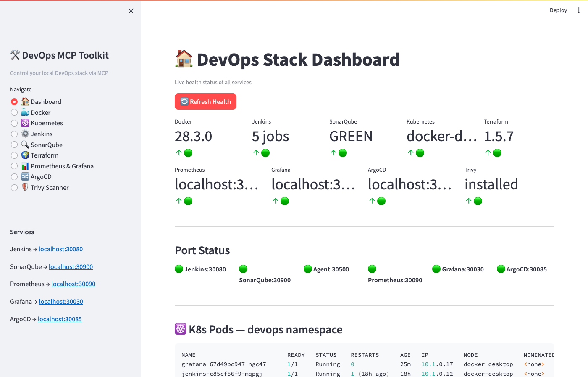
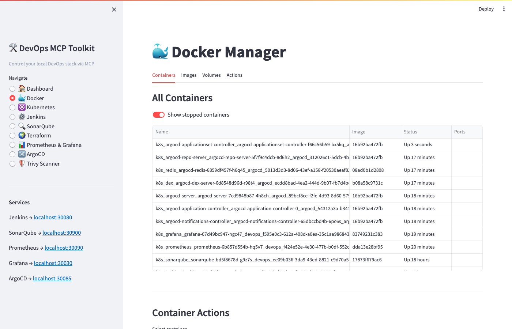
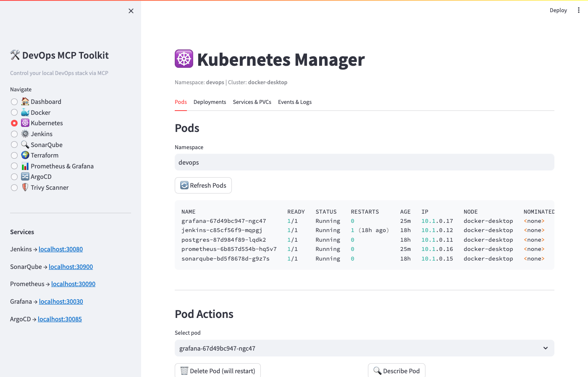
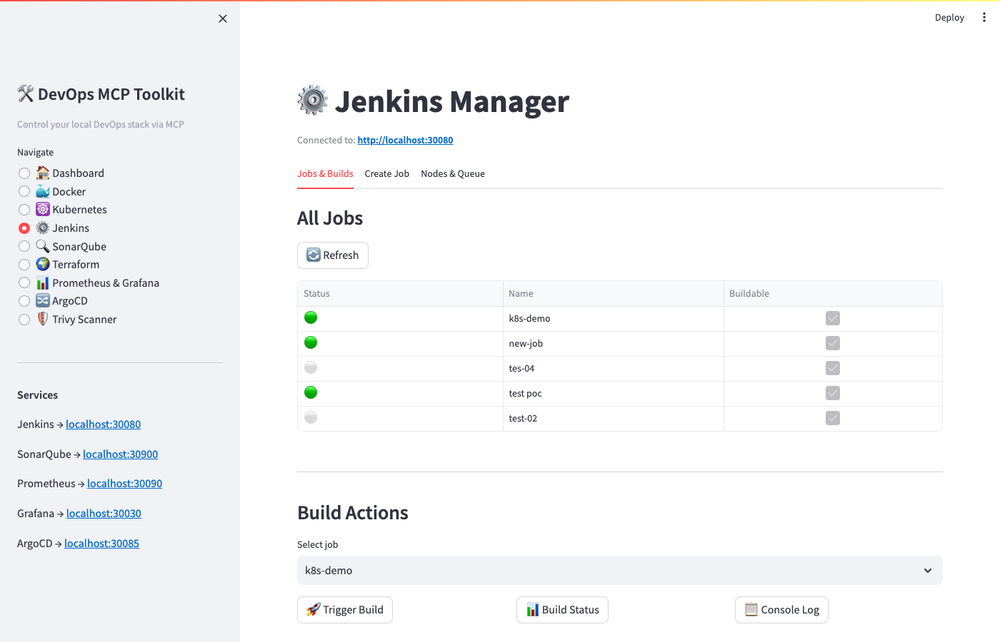
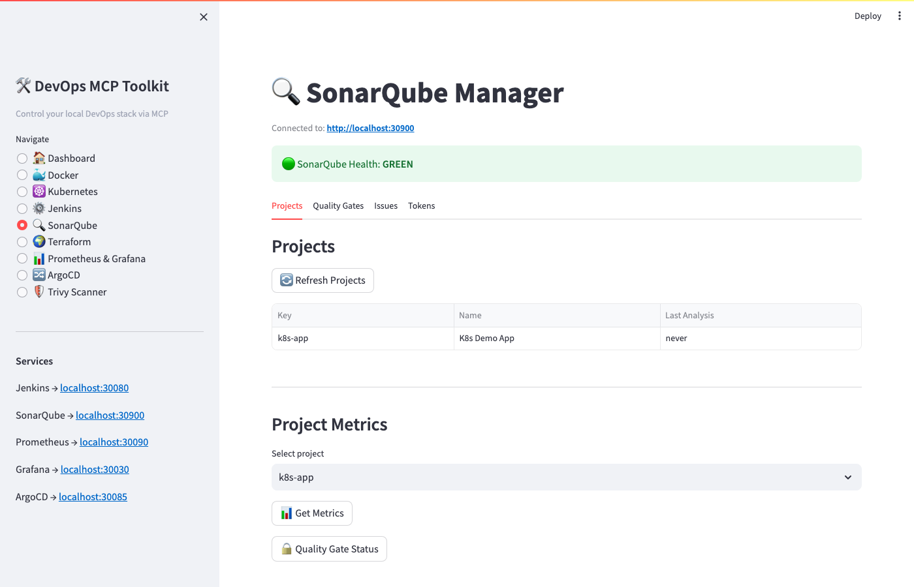
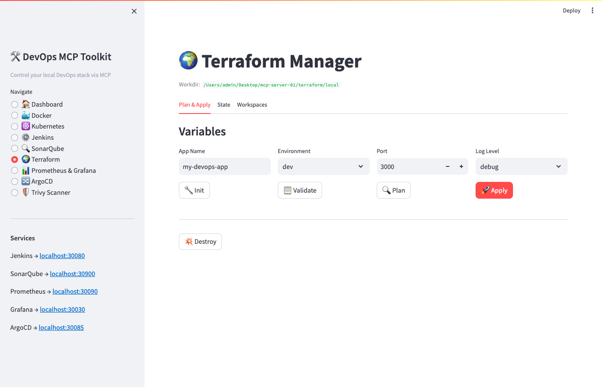
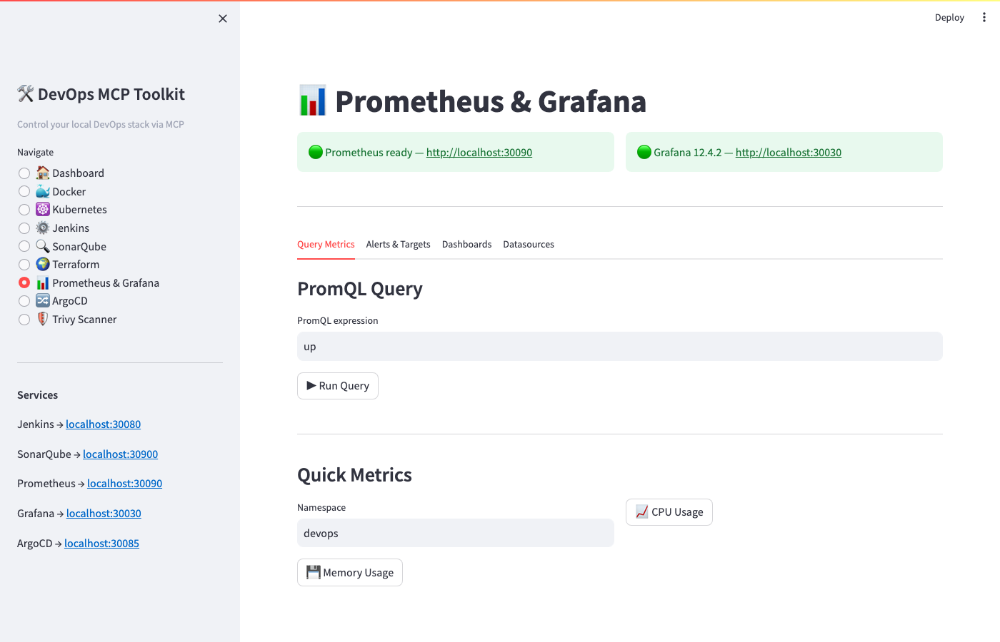
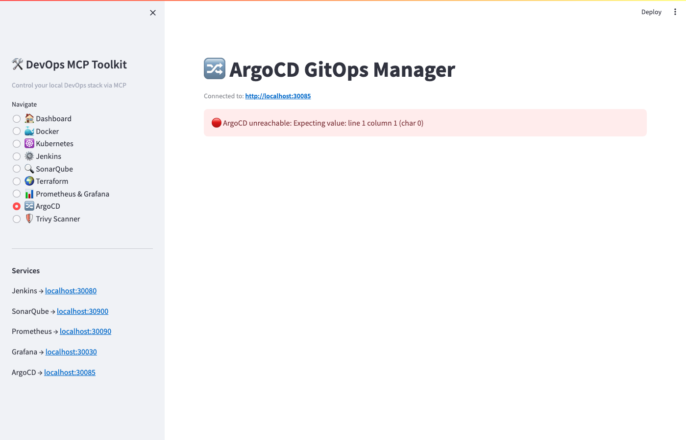
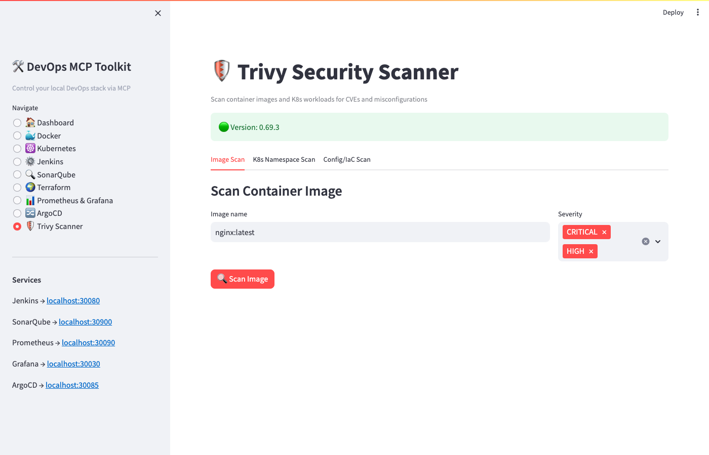

# DevOps MCP Toolkit

> 9 open-source MCP servers that let Claude control a full local DevOps stack running on Kubernetes — no cloud account required.

[](LICENSE)
[](https://python.org)
[](https://kubernetes.io)
[](https://modelcontextprotocol.io)
[](https://jenkins.io)
[](https://sonarqube.org)
[](https://prometheus.io)
[](https://grafana.com)
[](https://argoproj.github.io/cd)
[](https://trivy.dev)
[](https://terraform.io)

---

## Streamlit Control Panel

> Visual browser UI to control all 9 MCP servers — run with `python3 -m streamlit run streamlit_app/app.py`

| Dashboard | Docker Manager |
|-----------|---------------|
|  |  |

| Kubernetes Manager | Jenkins Manager |
|-------------------|----------------|
|  |  |

| SonarQube Manager | Terraform Manager |
|------------------|------------------|
|  |  |

| Prometheus & Grafana | ArgoCD GitOps |
|---------------------|--------------|
|  |  |

| Trivy Security Scanner | |
|----------------------|--|
|  | |

---

## What It Does

This toolkit exposes your entire local DevOps stack as MCP tools that Claude can call directly. Instead of switching between terminals and UIs, you interact with Jenkins, SonarQube, Docker, Terraform, Kubernetes, Prometheus, Grafana, ArgoCD, and Trivy through natural language.

**Example prompts:**
- *"Trigger the k8s-demo build in Jenkins and show me the console log"*
- *"Scan the nginx:latest image for CRITICAL vulnerabilities with Trivy"*
- *"Create an ArgoCD application from my Git repo and sync it"*
- *"Show me CPU and memory usage for all pods in the devops namespace via Prometheus"*
- *"Create a Grafana dashboard for pod CPU usage"*
- *"Run terraform plan on the local example and apply it to staging workspace"*
- *"What is the health of all 9 DevOps services?"*

---

## Architecture

```
Claude (claude.ai / Claude Code CLI)
        │
        │  MCP (stdio)
        ▼
┌────────────────────────────────────────────────────────┐
│                  MCP Servers (Python)                   │
│                                                        │
│  01 docker-manager      → Docker CLI                   │
│  02 terraform-manager   → Terraform CLI                │
│  03 sonarqube-manager   → SonarQube REST API           │
│  04 jenkins-manager     → Jenkins REST API             │
│  05 devops-dashboard    → Unified health check         │
│  06 kubernetes-manager  → kubectl / K8s API            │
│  07 prometheus-grafana  → Prometheus PromQL + Grafana  │
│  08 argocd-manager      → ArgoCD GitOps REST API       │
│  09 trivy-scanner       → Trivy CVE/IaC CLI            │
└────────────────────────────────────────────────────────┘
        │
        │  Kubernetes (Docker Desktop)
        ▼
┌────────────────────────────────────────────────────────┐
│  devops namespace          argocd namespace             │
│                                                        │
│  Jenkins      :30080       ArgoCD     :30085           │
│  SonarQube    :30900       (GitOps engine)             │
│  Prometheus   :30090                                   │
│  Grafana      :30030                                   │
│  PostgreSQL   ClusterIP (internal)                     │
└────────────────────────────────────────────────────────┘
```

---

## MCP Servers

| # | Server | Tools | Description |
|---|--------|-------|-------------|
| 1 | `docker-manager` | 15 | Containers, images, volumes, compose, stats, logs |
| 2 | `terraform-manager` | 12 | init, plan, apply, destroy, state, workspaces |
| 3 | `sonarqube-manager` | 12 | Projects, metrics, issues, quality gates, tokens |
| 4 | `jenkins-manager` | 14 | Jobs, builds, logs, queue, plugins, nodes |
| 5 | `devops-dashboard` | 7 | Unified health, port checks, service summaries |
| 6 | `kubernetes-manager` | 18 | Pods, deployments, services, PVCs, events, rollouts |
| 7 | `prometheus-grafana` | 15 | PromQL queries, alerts, targets, Grafana dashboards |
| 8 | `argocd-manager` | 12 | App CRUD, sync, rollback, JWT auth, repo management |
| 9 | `trivy-scanner` | 9 | Image CVE scan, K8s namespace scan, IaC config scan, SBOM |

**Total: 114 MCP tools**

---

## Service Credentials

| Service    | URL                        | Username | Password          |
|------------|----------------------------|----------|-------------------|
| Jenkins    | http://localhost:30080     | admin    | admin             |
| Grafana    | http://localhost:30030     | admin    | admin             |
| ArgoCD     | http://localhost:30085     | admin    | *(K8s secret)*    |
| Prometheus | http://localhost:30090     | —        | no auth           |
| SonarQube  | http://localhost:30900     | admin    | *(12+ char policy)* |

> **ArgoCD password:** `kubectl get secret argocd-initial-admin-secret -n argocd -o jsonpath='{.data.password}' | base64 --decode`

---

## Prerequisites

| Tool | Install |
|------|---------|
| Docker Desktop (with K8s enabled) | [docker.com](https://www.docker.com/products/docker-desktop/) |
| Python 3.11+ | `brew install python` |
| Claude Code CLI | [claude.ai/code](https://claude.ai/code) |
| kubectl | bundled with Docker Desktop |
| Terraform | `brew install terraform` |
| Trivy | `brew install trivy` |

---

## Quick Start

### 1. Clone & install
```bash
git clone https://github.com/narayanareddy11/devops-mcp-toolkit.git
cd devops-mcp-toolkit
pip3 install -r requirements.txt
```

### 2. Deploy to Kubernetes
```bash
# Core services
kubectl apply -f k8s/namespace.yaml
kubectl apply -f k8s/postgres/
kubectl apply -f k8s/jenkins/
kubectl apply -f k8s/sonarqube/

# Observability
kubectl apply -f k8s/prometheus/
kubectl apply -f k8s/grafana/

# ArgoCD
kubectl apply -f k8s/argocd/namespace.yaml
kubectl apply -n argocd -f https://raw.githubusercontent.com/argoproj/argo-cd/stable/manifests/install.yaml
kubectl patch svc argocd-server -n argocd --patch "$(cat k8s/argocd/nodeport-patch.yaml)"

# Wait for all pods
kubectl wait --for=condition=ready pod --all -n devops --timeout=300s
```

### 3. Register all 9 MCP servers
```bash
claude mcp add docker-manager \
  -- python3 servers/01_docker_manager.py

claude mcp add terraform-manager \
  -- python3 servers/02_terraform_manager.py

claude mcp add sonarqube-manager \
  -e SONAR_URL=http://localhost:30900 \
  -e SONAR_USER=admin \
  -e SONAR_PASS='<your-sonar-password>' \
  -- python3 servers/03_sonarqube_manager.py

claude mcp add jenkins-manager \
  -e JENKINS_URL=http://localhost:30080 \
  -e JENKINS_USER=admin \
  -e JENKINS_PASS=admin \
  -- python3 servers/04_jenkins_manager.py

claude mcp add devops-dashboard \
  -e JENKINS_URL=http://localhost:30080 -e JENKINS_USER=admin -e JENKINS_PASS=admin \
  -e SONAR_URL=http://localhost:30900  -e SONAR_USER=admin  -e SONAR_PASS='<your-sonar-password>' \
  -- python3 servers/05_devops_dashboard.py

claude mcp add kubernetes-manager \
  -- python3 servers/06_kubernetes_manager.py

claude mcp add prometheus-grafana \
  -e PROMETHEUS_URL=http://localhost:30090 \
  -e GRAFANA_URL=http://localhost:30030 \
  -e GRAFANA_USER=admin -e GRAFANA_PASS=admin \
  -- python3 servers/07_prometheus_grafana.py

claude mcp add argocd-manager \
  -e ARGOCD_URL=http://localhost:30085 \
  -e ARGOCD_USER=admin \
  -- python3 servers/08_argocd_manager.py

claude mcp add trivy-scanner \
  -- python3 servers/09_trivy_scanner.py
```

### 4. Launch Streamlit control panel
```bash
python3 -m streamlit run streamlit_app/app.py --server.port 8501
# Open http://localhost:8501
```

---

## Project Structure

```
devops-mcp-toolkit/
├── LICENSE
├── README.md
├── CLAUDE.md                        ← context for Claude Code
├── requirements.txt
├── claude_mcp_config.json           ← all 9 MCP servers config
├── servers/
│   ├── 01_docker_manager.py
│   ├── 02_terraform_manager.py
│   ├── 03_sonarqube_manager.py
│   ├── 04_jenkins_manager.py
│   ├── 05_devops_dashboard.py
│   ├── 06_kubernetes_manager.py
│   ├── 07_prometheus_grafana.py
│   ├── 08_argocd_manager.py
│   └── 09_trivy_scanner.py
├── k8s/
│   ├── namespace.yaml
│   ├── jenkins/                     ← NodePort 30080
│   ├── sonarqube/                   ← NodePort 30900
│   ├── postgres/                    ← ClusterIP
│   ├── prometheus/                  ← NodePort 30090 + RBAC
│   ├── grafana/                     ← NodePort 30030
│   └── argocd/                      ← NodePort 30085/30086 patch
├── streamlit_app/
│   ├── app.py                       ← 9-page control panel
│   └── utils.py                     ← shared http/shell helpers
├── tests/
│   ├── conftest.py
│   ├── test_01_docker_manager.py
│   ├── test_02_terraform_manager.py
│   ├── test_03_sonarqube_manager.py
│   └── test_04_jenkins_manager.py
└── terraform/
    └── local/                       ← local + null providers
```

---

## Known Issues & Fixes

| Issue | Fix Applied |
|-------|------------|
| SonarQube readiness probe returns 401 | Changed to `tcpSocket` probe |
| SonarQube Elasticsearch OOM on Docker Desktop | `SONAR_SEARCH_JAVAOPTS=-Dnode.store.allow_mmap=false` |
| Jenkins POST requests return 403 | Fetch fresh CSRF crumb per session |
| ArgoCD self-signed cert | `verify=False` on all ArgoCD httpx calls |
| Streamlit ternary widget bug | Use `if/else` blocks with `show()` helper |

---

## GitHub Actions

This repo includes two Claude-powered workflows:

- **`claude.yml`** — mention `@claude` in any issue or PR comment to invoke Claude Code
- **`claude-code-review.yml`** — automatically reviews every pull request with Claude

Both require `CLAUDE_CODE_OAUTH_TOKEN` to be set in repository secrets.

---

## Contributing

Pull requests are welcome. For major changes, open an issue first.

1. Fork the repo
2. Create a feature branch (`git checkout -b feature/new-mcp-server`)
3. Commit your changes
4. Open a PR — Claude will auto-review it

---

## License

[MIT](LICENSE) © 2026 Narayana Reddy
