# DevOps MCP Toolkit

> **15 open-source MCP servers** that let Claude control a full local DevOps stack running on Kubernetes — no cloud account required.

[](LICENSE)
[](https://python.org)
[](https://kubernetes.io)
[](https://modelcontextprotocol.io)
[](https://jenkins.io)
[](https://sonarqube.org)
[](https://prometheus.io)
[](https://grafana.com)
[](https://argoproj.github.io/cd)
[](https://trivy.dev)
[](https://vaultproject.io)
[](https://helm.sh)
[](https://min.io)

---

## Streamlit Control Panel

> 15-page visual control panel — `python3 -m streamlit run streamlit_app/app.py`

| Dashboard | Docker Manager |
|-----------|----------------|
| 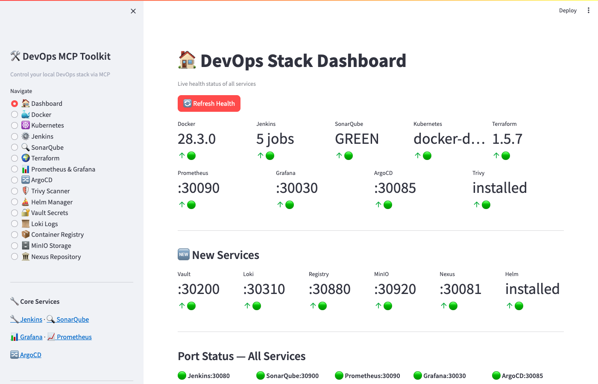 | 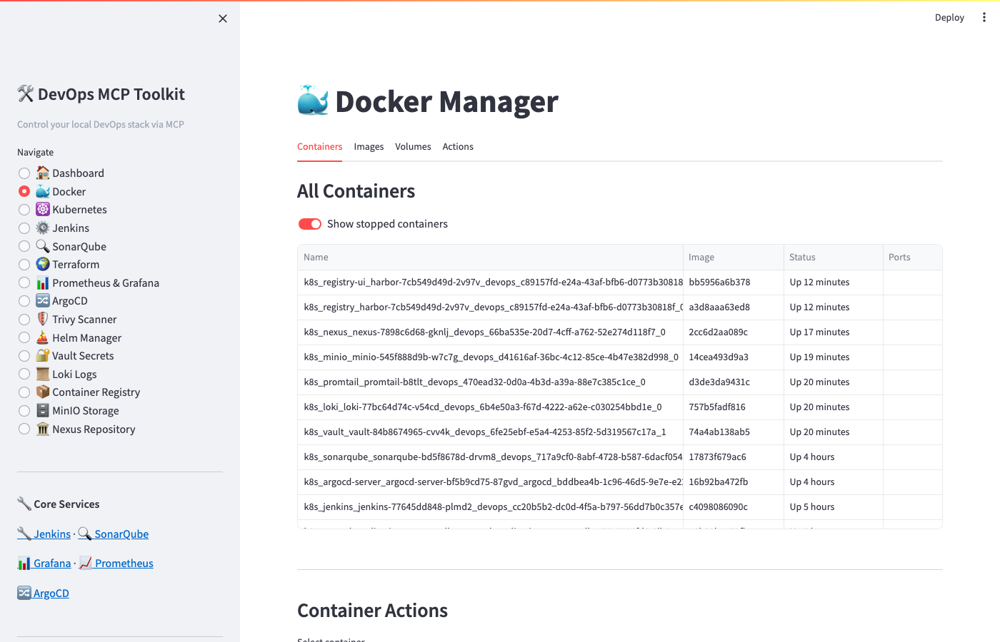 |

| Kubernetes Manager | Jenkins Manager |
|-------------------|----------------|
| 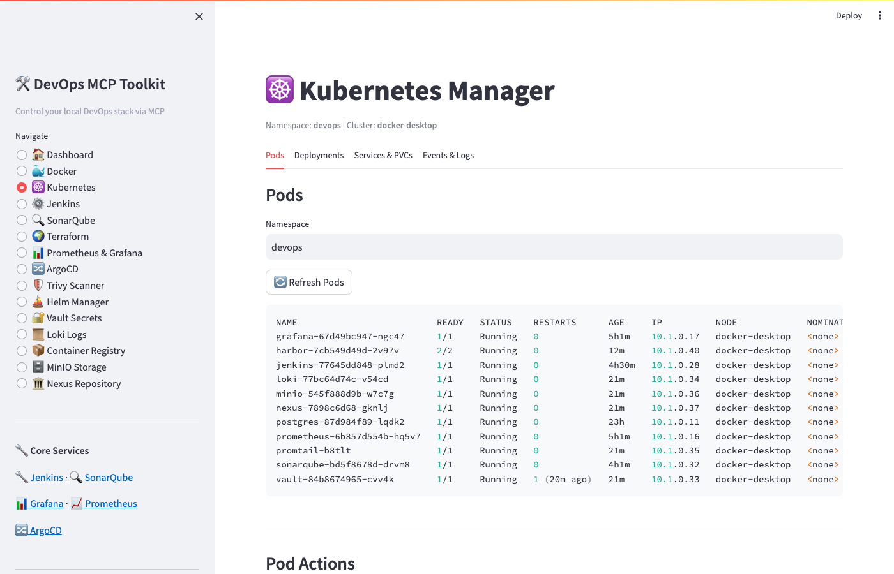 | 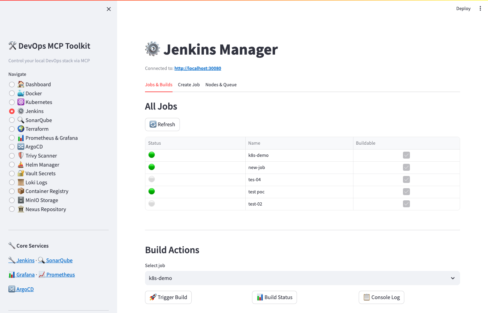 |

| SonarQube Manager | Terraform Manager |
|------------------|------------------|
| 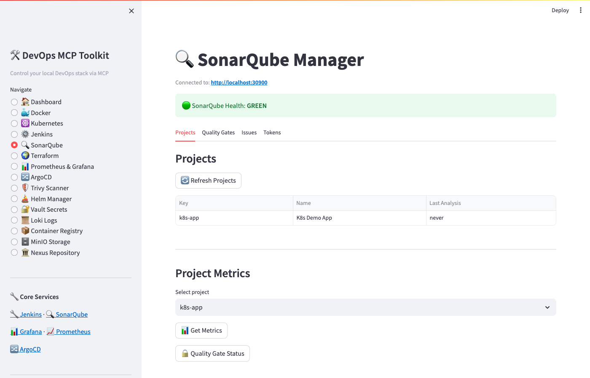 | 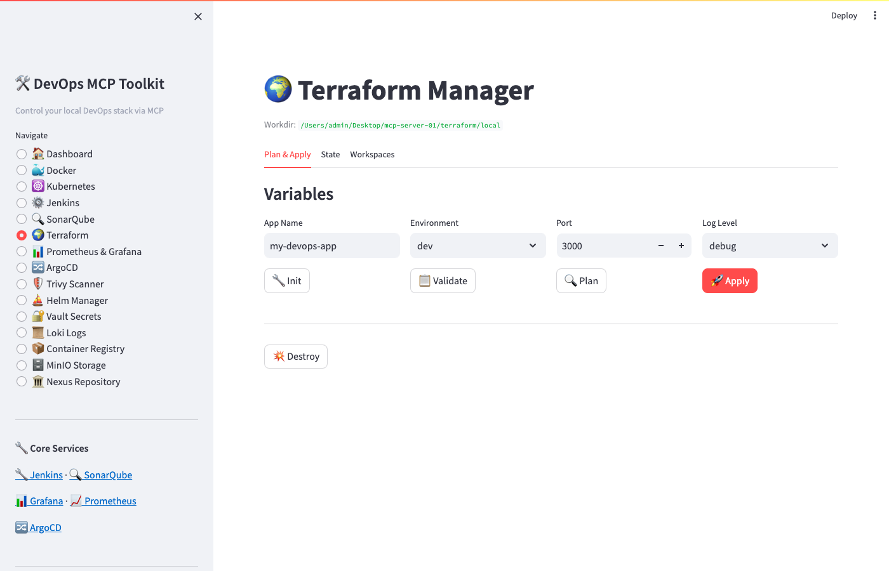 |

| Prometheus & Grafana | ArgoCD GitOps |
|---------------------|--------------|
| 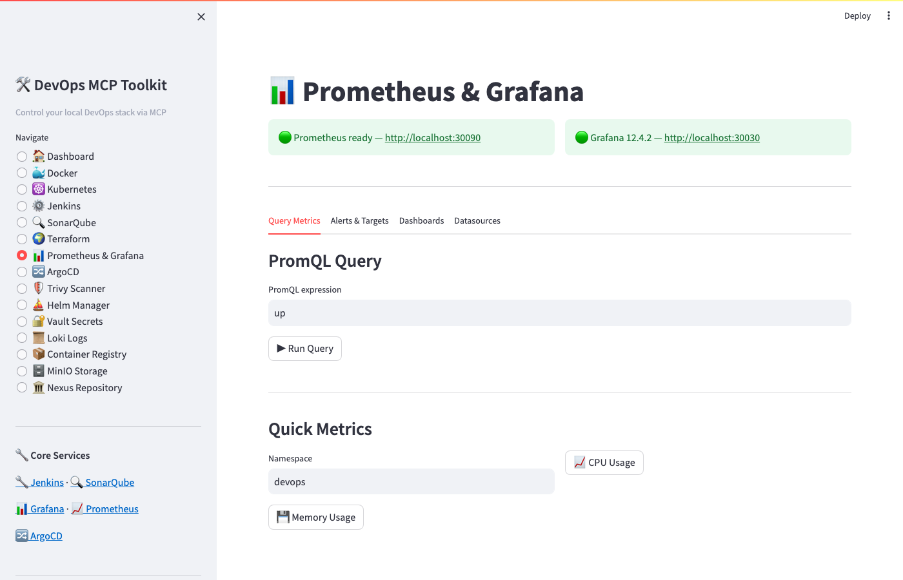 | 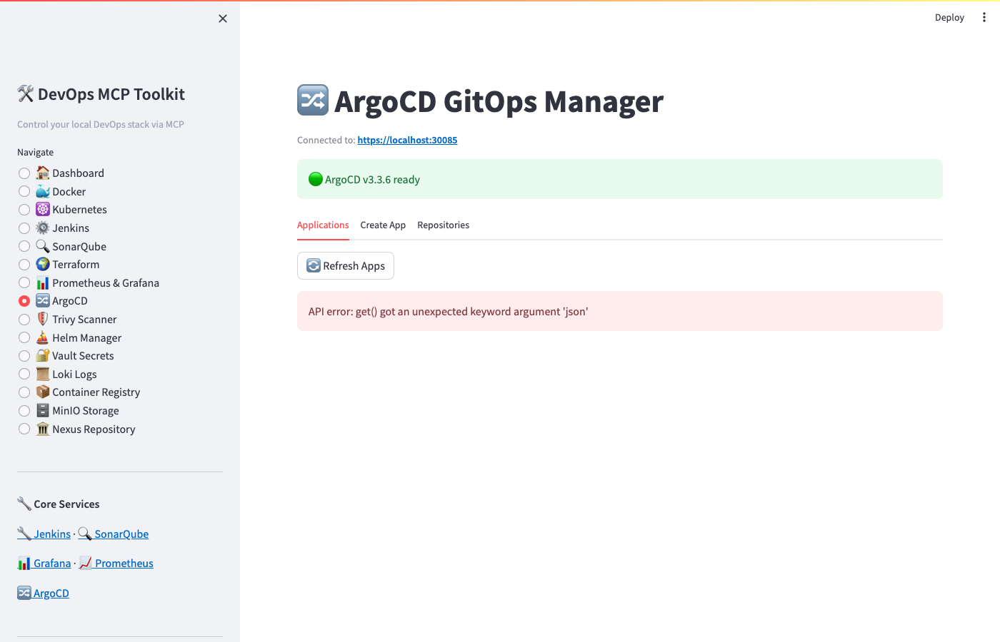 |

| Trivy Security Scanner | Helm Manager |
|----------------------|-------------|
| 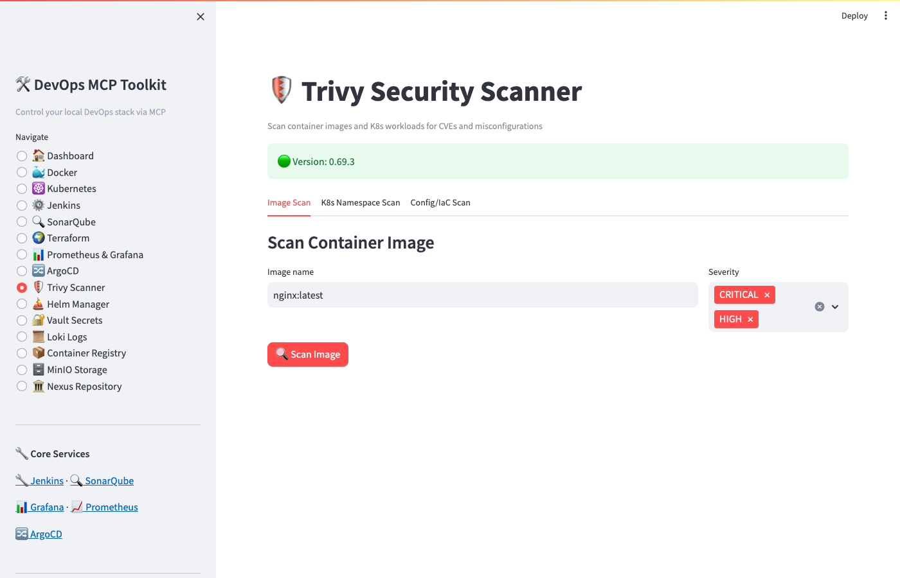 | 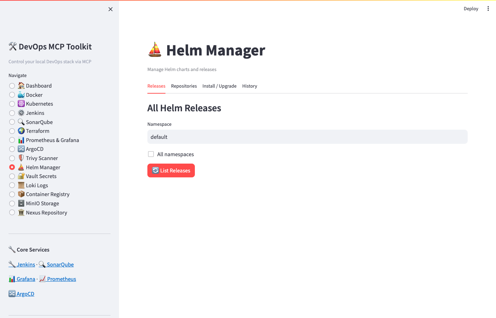 |

| Vault Secrets | Loki Logs |
|--------------|-----------|
| 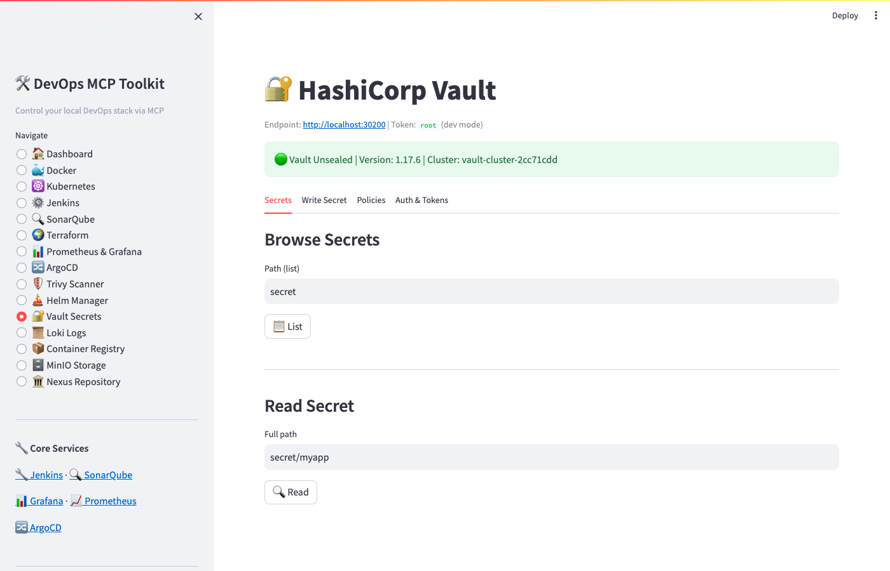 | 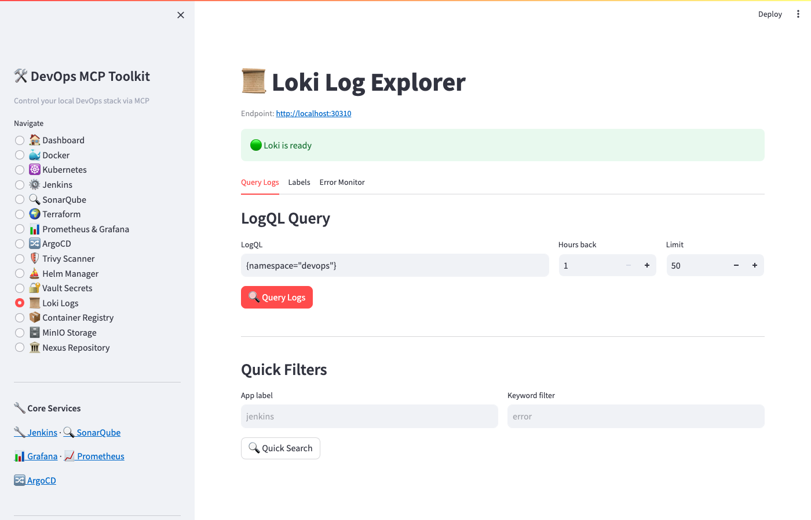 |

| Container Registry | MinIO Storage |
|-------------------|--------------|
| 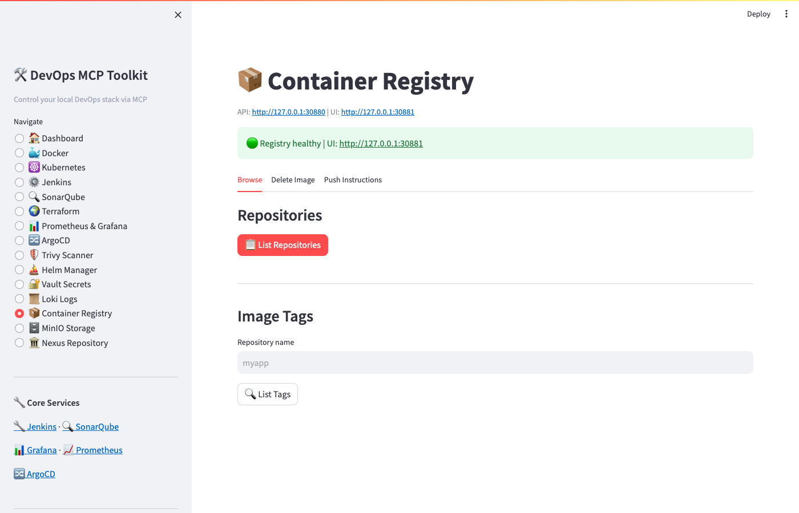 | 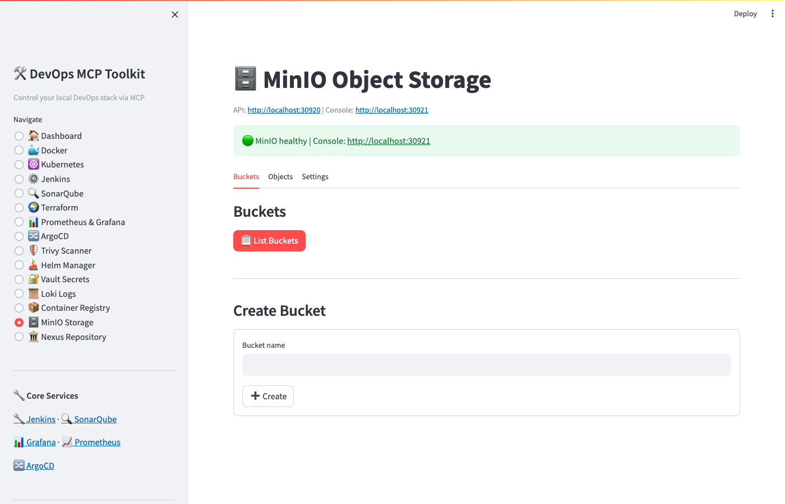 |

| Nexus Repository | |
|-----------------|--|
| 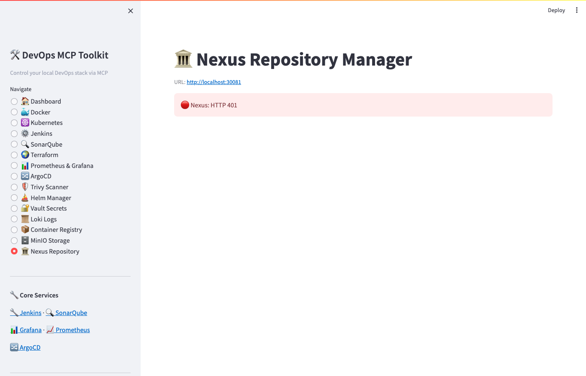 | |

---

## What It Does

This toolkit exposes your entire local DevOps stack as MCP tools that Claude can call directly. Instead of switching between terminals and UIs, you interact with Jenkins, SonarQube, Docker, Terraform, Kubernetes, Prometheus, Grafana, ArgoCD, Trivy, Vault, Helm, Loki, Harbor Registry, MinIO, and Nexus through natural language.

**Example prompts:**
- *"Trigger the k8s-demo build in Jenkins and show me the console log"*
- *"Scan the nginx:latest image for CRITICAL vulnerabilities with Trivy"*
- *"Create an ArgoCD application from my Git repo and sync it"*
- *"Store the database password in Vault and create a policy for it"*
- *"Show me all error logs from the devops namespace in the last hour via Loki"*
- *"Install the bitnami/nginx Helm chart in the staging namespace"*
- *"Create an S3 bucket in MinIO for Terraform state storage"*
- *"What is the health of all 15 DevOps services?"*

---

## Architecture

```
Claude (claude.ai / Claude Code CLI)
        │
        │  MCP (stdio)
        ▼
┌─────────────────────────────────────────────────────────────┐
│                    MCP Servers (Python)                      │
│                                                             │
│  01 docker-manager      → Docker CLI                        │
│  02 terraform-manager   → Terraform CLI                     │
│  03 sonarqube-manager   → SonarQube REST API                │
│  04 jenkins-manager     → Jenkins REST API                  │
│  05 devops-dashboard    → Unified health check              │
│  06 kubernetes-manager  → kubectl / K8s API                 │
│  07 prometheus-grafana  → Prometheus PromQL + Grafana API   │
│  08 argocd-manager      → ArgoCD GitOps REST API            │
│  09 trivy-scanner       → Trivy CVE/IaC CLI                 │
│  10 helm-manager        → Helm CLI                          │
│  11 vault-manager       → HashiCorp Vault HTTP API          │
│  12 loki-manager        → Grafana Loki LogQL API            │
│  13 harbor-manager      → Docker Registry v2 API            │
│  14 minio-manager       → MinIO S3 API (mc CLI)             │
│  15 nexus-manager       → Nexus Repository REST API         │
└─────────────────────────────────────────────────────────────┘
        │
        │  Kubernetes (Docker Desktop)
        ▼
┌─────────────────────────────────────────────────────────────┐
│  devops namespace                  argocd namespace          │
│                                                             │
│  Jenkins      :30080               ArgoCD     :30085        │
│  SonarQube    :30900               (GitOps engine)          │
│  Prometheus   :30090                                        │
│  Grafana      :30030               NEW SERVICES             │
│  PostgreSQL   ClusterIP            Vault      :30200        │
│                                    Loki       :30310        │
│                                    Registry   :30880        │
│                                    MinIO      :30920/:30921 │
│                                    Nexus      :30081        │
└─────────────────────────────────────────────────────────────┘
```

---

## MCP Servers

| # | Server | Tools | Description |
|---|--------|-------|-------------|
| 1 | `docker-manager` | 15 | Containers, images, volumes, compose, stats, logs |
| 2 | `terraform-manager` | 12 | init, plan, apply, destroy, state, workspaces |
| 3 | `sonarqube-manager` | 12 | Projects, metrics, issues, quality gates, tokens |
| 4 | `jenkins-manager` | 14 | Jobs, builds, logs, queue, plugins, nodes |
| 5 | `devops-dashboard` | 7 | Unified health, port checks, service summaries |
| 6 | `kubernetes-manager` | 18 | Pods, deployments, services, PVCs, events, rollouts |
| 7 | `prometheus-grafana` | 15 | PromQL queries, alerts, targets, Grafana dashboards |
| 8 | `argocd-manager` | 12 | App CRUD, sync, rollback, JWT auth, repo management |
| 9 | `trivy-scanner` | 9 | Image CVE scan, K8s namespace scan, IaC config scan, SBOM |
| 10 | `helm-manager` | 14 | Repos, search, install, upgrade, rollback, history, lint |
| 11 | `vault-manager` | 15 | Secrets CRUD, policies, auth methods, token management |
| 12 | `loki-manager` | 9 | LogQL queries, label discovery, error monitoring |
| 13 | `harbor-manager` | 8 | Registry catalog, tags, manifests, delete, push instructions |
| 14 | `minio-manager` | 13 | Buckets, objects, upload, download, policies, users |
| 15 | `nexus-manager` | 12 | Repositories, components, assets, blob stores, users |

**Total: 185 MCP tools across 15 servers**

---

## Service Credentials

| Service          | URL                         | Username | Password            |
|------------------|-----------------------------|----------|---------------------|
| Jenkins          | http://localhost:30080      | admin    | Admin@123456789@    |
| SonarQube        | http://localhost:30900      | admin    | Admin@123456789@    |
| Grafana          | http://localhost:30030      | admin    | Admin@123456789@    |
| ArgoCD           | https://localhost:30085     | admin    | Admin@123456789@    |
| Prometheus       | http://localhost:30090      | —        | no auth             |
| Vault            | http://localhost:30200      | —        | token: `root`       |
| Loki             | http://localhost:30310      | —        | no auth             |
| Container Registry | http://127.0.0.1:30880    | —        | no auth (local dev) |
| Registry UI      | http://127.0.0.1:30881      | —        | no auth             |
| MinIO API        | http://localhost:30920      | admin    | Admin@123456789@    |
| MinIO Console    | http://localhost:30921      | admin    | Admin@123456789@    |
| Nexus            | http://localhost:30081      | admin    | Admin@123456789@    |

---

## Prerequisites

| Tool | Install |
|------|---------|
| Docker Desktop (with K8s enabled) | [docker.com](https://www.docker.com/products/docker-desktop/) |
| Python 3.11+ | `brew install python` |
| Claude Code CLI | [claude.ai/code](https://claude.ai/code) |
| kubectl | bundled with Docker Desktop |
| Terraform | `brew install terraform` |
| Trivy | `brew install trivy` |
| Helm | `brew install helm` |
| MinIO Client | `brew install minio-mc` |

---

## Quick Start

### 1. Clone & install
```bash
git clone https://github.com/narayanareddy11/devops-mcp-toolkit.git
cd devops-mcp-toolkit
pip3 install -r requirements.txt
```

### 2. Deploy to Kubernetes
```bash
# Core services
kubectl apply -f k8s/namespace.yaml
kubectl apply -f k8s/postgres/
kubectl apply -f k8s/jenkins/
kubectl apply -f k8s/sonarqube/

# Observability
kubectl apply -f k8s/prometheus/
kubectl apply -f k8s/grafana/

# ArgoCD
kubectl apply -f k8s/argocd/namespace.yaml
kubectl apply -n argocd -f https://raw.githubusercontent.com/argoproj/argo-cd/stable/manifests/install.yaml
kubectl patch svc argocd-server -n argocd --patch "$(cat k8s/argocd/nodeport-patch.yaml)"

# New tools (Vault, Loki, Registry, MinIO, Nexus)
kubectl apply -f k8s/vault/
kubectl apply -f k8s/loki/
kubectl apply -f k8s/harbor/
kubectl apply -f k8s/minio/deployment.yaml
kubectl apply -f k8s/nexus/deployment.yaml

# Wait for all pods
kubectl wait --for=condition=ready pod --all -n devops --timeout=300s
```

### 3. Register all 15 MCP servers
```bash
claude mcp add docker-manager    -- python3 servers/01_docker_manager.py
claude mcp add terraform-manager -- python3 servers/02_terraform_manager.py
claude mcp add sonarqube-manager -e SONAR_URL=http://localhost:30900 -e SONAR_USER=admin -e SONAR_PASS='Admin@123456789@' -- python3 servers/03_sonarqube_manager.py
claude mcp add jenkins-manager   -e JENKINS_URL=http://localhost:30080 -e JENKINS_USER=admin -e JENKINS_PASS='Admin@123456789@' -- python3 servers/04_jenkins_manager.py
claude mcp add devops-dashboard  -e JENKINS_URL=http://localhost:30080 -e JENKINS_USER=admin -e JENKINS_PASS='Admin@123456789@' -e SONAR_URL=http://localhost:30900 -e SONAR_USER=admin -e SONAR_PASS='Admin@123456789@' -- python3 servers/05_devops_dashboard.py
claude mcp add kubernetes-manager -- python3 servers/06_kubernetes_manager.py
claude mcp add prometheus-grafana -e PROMETHEUS_URL=http://localhost:30090 -e GRAFANA_URL=http://localhost:30030 -e GRAFANA_USER=admin -e GRAFANA_PASS='Admin@123456789@' -- python3 servers/07_prometheus_grafana.py
claude mcp add argocd-manager    -e ARGOCD_URL=https://localhost:30085 -e ARGOCD_USER=admin -e ARGOCD_PASS='Admin@123456789@' -- python3 servers/08_argocd_manager.py
claude mcp add trivy-scanner     -- python3 servers/09_trivy_scanner.py
claude mcp add helm-manager      -- python3 servers/10_helm_manager.py
claude mcp add vault-manager     -e VAULT_URL=http://localhost:30200 -e VAULT_TOKEN=root -- python3 servers/11_vault_manager.py
claude mcp add loki-manager      -e LOKI_URL=http://localhost:30310 -- python3 servers/12_loki_manager.py
claude mcp add harbor-manager    -e HARBOR_URL=http://127.0.0.1:30880 -- python3 servers/13_harbor_manager.py
claude mcp add minio-manager     -e MINIO_URL=http://localhost:30920 -e MINIO_ACCESS_KEY=admin -e MINIO_SECRET_KEY='Admin@123456789@' -- python3 servers/14_minio_manager.py
claude mcp add nexus-manager     -e NEXUS_URL=http://localhost:30081 -e NEXUS_USER=admin -e NEXUS_PASS='Admin@123456789@' -- python3 servers/15_nexus_manager.py
```

### 4. Launch Streamlit control panel
```bash
python3 -m streamlit run streamlit_app/app.py --server.port 8501
# Open http://localhost:8501
```

---

## Project Structure

```
devops-mcp-toolkit/
├── LICENSE
├── README.md
├── CLAUDE.md                        ← context for Claude Code
├── requirements.txt
├── claude_mcp_config.json           ← all 15 MCP servers config
├── servers/
│   ├── 01_docker_manager.py
│   ├── 02_terraform_manager.py
│   ├── 03_sonarqube_manager.py
│   ├── 04_jenkins_manager.py
│   ├── 05_devops_dashboard.py
│   ├── 06_kubernetes_manager.py
│   ├── 07_prometheus_grafana.py
│   ├── 08_argocd_manager.py
│   ├── 09_trivy_scanner.py
│   ├── 10_helm_manager.py           ← NEW
│   ├── 11_vault_manager.py          ← NEW
│   ├── 12_loki_manager.py           ← NEW
│   ├── 13_harbor_manager.py         ← NEW
│   ├── 14_minio_manager.py          ← NEW
│   └── 15_nexus_manager.py          ← NEW
├── k8s/
│   ├── namespace.yaml
│   ├── jenkins/                     ← NodePort 30080
│   ├── sonarqube/                   ← NodePort 30900
│   ├── postgres/                    ← ClusterIP
│   ├── prometheus/                  ← NodePort 30090
│   ├── grafana/                     ← NodePort 30030
│   ├── argocd/                      ← NodePort 30085/30086
│   ├── vault/                       ← NodePort 30200  NEW
│   ├── loki/                        ← NodePort 30310  NEW
│   ├── harbor/                      ← NodePort 30880  NEW
│   ├── minio/                       ← NodePort 30920/30921  NEW
│   └── nexus/                       ← NodePort 30081  NEW
├── streamlit_app/
│   ├── app.py                       ← 15-page control panel
│   └── utils.py                     ← shared http/shell helpers
├── docs/
│   └── screenshots/                 ← 15 page screenshots
├── tests/
│   ├── conftest.py
│   └── test_*.py
└── terraform/
    └── local/                       ← local + null providers
```

---

## Known Issues & Fixes

| Issue | Fix Applied |
|-------|------------|
| SonarQube readiness probe returns 401 | Changed to `tcpSocket` probe |
| SonarQube Elasticsearch OOM on Docker Desktop | `SONAR_SEARCH_JAVAOPTS=-Dnode.store.allow_mmap=false` |
| Jenkins POST requests return 403 | Fetch fresh CSRF crumb per session |
| ArgoCD self-signed cert | `verify=False` on all ArgoCD httpx calls; URL uses `https://` |
| ArgoCD HTTP→HTTPS redirect | MCP server uses `https://localhost:30085` |
| Registry NodePort IPv6 issue | Use `127.0.0.1:30880` instead of `localhost:30880` |
| Streamlit ternary widget bug | Use `if/else` blocks with `show()` helper |

---

## GitHub Actions

This repo includes two Claude-powered workflows:

- **`claude.yml`** — mention `@claude` in any issue or PR comment to invoke Claude Code
- **`claude-code-review.yml`** — automatically reviews every pull request with Claude

Both require `CLAUDE_CODE_OAUTH_TOKEN` to be set in repository secrets.

---

## Contributing

Pull requests are welcome. For major changes, open an issue first.

1. Fork the repo
2. Create a feature branch (`git checkout -b feature/new-mcp-server`)
3. Commit your changes
4. Open a PR — Claude will auto-review it

---

## License

[MIT](LICENSE) © 2026 Narayana Reddy
